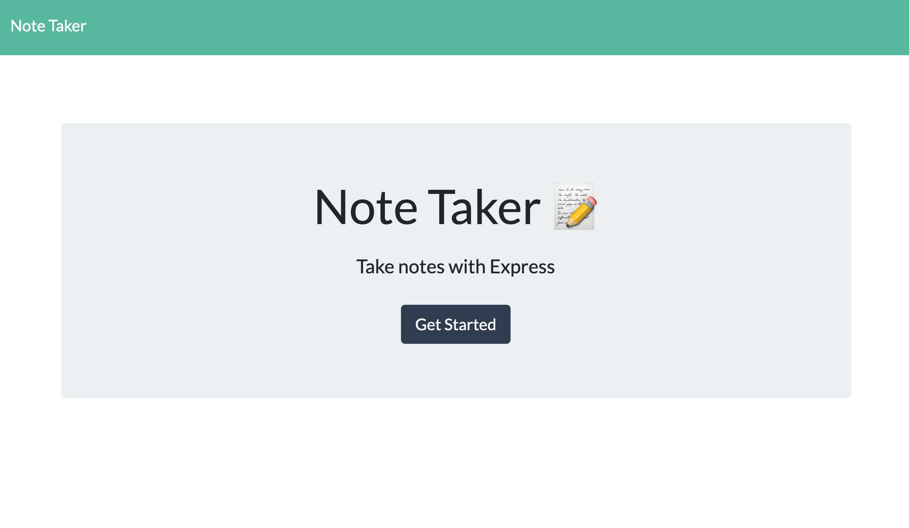
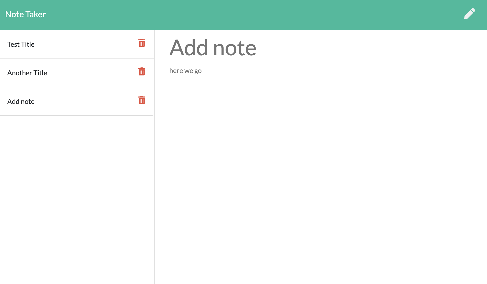

  # Note Taker Starter Code

  ## Description
  This is a site that generates notes.
  
  ## Table of Contents:
  * [Description](#description)
  * [Installation](#installation)
  * [Built With](#built-with)
  * [Repository](#repository)
  * [Usage](#usage)
  * [Contributions](#contributions)
  * [License](#license)

  ## Installation
  First you will clone the respository to your own computer. Then make sure you have node.js, npm, express and uuid installed. Run the application in the terminal with "npm start" and open "localhost:3002" in the browser. Alternatively use the Heroku link.

  ## Built With
  Node, JavaScript, NPM, Express, uuid

  ## Repository
  [Repository Link](https://github.com/Mbogaert/note-taker)

  ## Screenshot
  Landing Page
  
  Notes Page
  

  ## Useage
  This project can be used to craft store your notes.

  ## Contributions
  Made with Pride by Mathew Bogaert

  ## License
  This application is unlicensed.